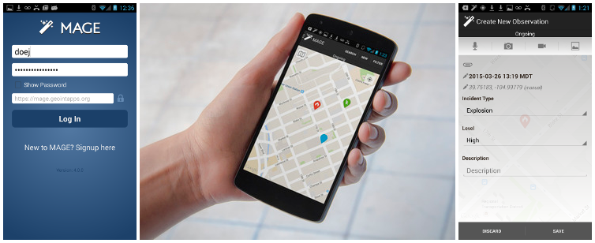

# MAGE Android

11/16/2015

This is the MAGE client for Android devices.



Depends on the [MAGE Android SDK](https://github.com/ngageoint/mage-android-sdk).

## About

The **M**obile **A**wareness **G**EOINT **E**nvironment, or MAGE, provides mobile situational awareness capabilities. The MAGE app on your mobile device allows you to create geotagged field reports that contain media such as photos, videos, and voice recordings and share them instantly with who you want. Using the GPS in your mobile device, MAGE can also track users locations in real time. Your locations can be automatically shared with the other members of your team.

The app remains functional if your mobile device loses its network connection, and will upload its local content when a connection is re-established. When disconnected from the network, MAGE will use local data layers to continue to provide relevant GEOINT. Data layers, including map tiles and vector data, can be stored on your mobile device and are available at all times.

MAGE is very customizable and can be tailored for you situation.

MAGE Android was developed at the National Geospatial-Intelligence Agency (NGA) in collaboration with BIT Systems. The government has "unlimited rights" and is releasing this software to increase the impact of government investments by providing developers with the opportunity to take things in new directions. The software use, modification, and distribution rights are stipulated within the Apache license.

## How to Build

These instructions are for *nix operating systems.  Do not use Windows systems to build MAGE.  The following example commands are for debian based linux systems like Ubuntu.

You will need to install the Java and Android sdks to build MAGE Android.

### Java SDK

Check to see if you have Java installed:
```bash
javac -version
```

If you already have Java 1.8.* installed you can skip to the next section, Android.

Install a version of java:
```bash
sudo apt-add-repository ppa:webupd8team/java
sudo apt-get update
sudo apt-get install oracle-java8-installer
```

If you prefer openJDK:
```bash
sudo apt-get install openjdk-8-jre
```

Verify:
```bash
javac -version
```

### Android SDK

Download the Stand-alone SDK Tools, or Android Studio:
http://developer.android.com/sdk/index.html#Other

Unpack and install the contents:
```bash
tar zxvf android-sdk-linux.tgz
mv android-sdk-linux ~
echo "export ANDROID_HOME=`echo $HOME`/android-sdk-linux" >> ~/.bashrc && source ~/.bashrc
```

Use the Android SDK Manager GUI to install the correct version of the android sdk to your system:
```bash
~/android-sdk-linux/tools/android
```

Check the [build configuration](mage/build.gradle#L8-L9) for the version of android you will need.  You will also need to install Android Support Repository, Android Support Library, Google Play services, and Google Repository using the Android SDK Manager.

### Signing

Android requires that you sign your applications.  You will need to create an identity to sign your MAGE Android build.  If you don't plan on releasing your build of MAGE, use *Debug Build* instructions, otherwise use the *Release Build* instructions.  If you aren't sure, follow the *Debug Build* instructions.

##### Debug Build

First, check to see if you have a *~/.android/debug.keystore*.  If the file does not exist, generate one using keytool:
```bash
keytool -genkey -v -keystore ~/.android/debug.keystore -storepass android -alias androiddebugkey -keypass android -dname "CN=Android Debug,O=Android,C=US" -validity 14000
```

When finished, *~/.android/debug.keystore* should now exist on your system.  Verify the information you entered looks correct:
```bash
keytool -list -keystore  ~/.android/debug.keystore
```

If prompted for a password, enter *android*.  

##### Release Build

Only follow these instructions if you would like to release or distribute your build of MAGE.  If you already have a *~/.android/release.keystore* skip to the next section, *Google Maps Android API*.  If you don't have a *~/.android/release.keystore* (or production keystore you use to sign other Android applications), create a new keystore file using the keytool utility:
```bash
keytool -genkey -v -keystore ~/.android/release.keystore -alias androidreleasekey -validity 14000
```

When finished, *~/.android/release.keystore* should now exist on your system.  Verify the information you entered looks correct:
```bash
keytool -list -keystore  ~/.android/release.keystore
```

### Google Maps Android API

MAGE Android uses Google Maps.  Whether you build a debug or release version of the application, you will need to obtain a Google Maps API key to use Android Google's Maps.

First, go to [Google's API Library](https://console.developers.google.com/) with a valid Google account, and enable the *Google Maps Android API* in the *API Manager* -> *APIs* section.  Next, in the *Credentials* section, *Create Credentials* -> *API key* -> *Android key*.  Enter a key name, or accept the default.  Add package name and fingerprint, enter *mil.nga.giat.mage* for the package name, and the SHA-1 certificate fingerprint from the keystore you made.  You can get the SHA-1 hash from the debug.keystore (if this is a release build, use your release keystore instead) you made using the command line:
```bash
keytool -list -keystore ~/.android/debug.keystore
```

If prompted for a password, enter *android*.  Finally, click *Create* in Google's developer console.  Once created, you should be prompted with a hash that represents the Android Google Maps API key.

To link the MAGE application with this api key you have just made, you must edit the *DEBUG_MAPS_API_KEY* value in [gradle.properties file](gradle.properties) and enter your Android Google Maps API key hash.  Congratulations!  You are all done configuring your very own debug build of MAGE Android.

### Build

The MAGE Android application (apk) is built using [gradle](http://gradle.org/).  These instructions build a debug version of the application that is **not for release**.

Before you build the MAGE Android application, make sure to download, build and deploy the [MAGE SDK](https://github.com/ngageoint/mage-android-sdk#how-to-build) dependency to your local maven repository first.

This command will create the Android package that you will install on the phone:

```bash
./gradlew clean
./gradlew assembleDebug
file ./mage/build/outputs/apk/mage-android-defaults-debug.apk
```

### Install

With a device connected to your machine, you can install the MAGE app with the following command:
```bash
./gradlew installDefaultsDebug
```

### Test

Run the tests on your device:
```bash
./gradlew connectedDefaultsDebugAndroidTest
```

## Pull Requests

If you'd like to contribute to this project, please make a pull request. We'll review the pull request and discuss the changes. All pull request contributions to this project will be released under the Apache license.

Software source code previously released under an open source license and then modified by NGA staff is considered a "joint work" (see 17 USC § 101); it is partially copyrighted, partially public domain, and as a whole is protected by the copyrights of the non-government authors and must be released according to the terms of the original open source license.

## License

Copyright 2015 BIT Systems

Licensed under the Apache License, Version 2.0 (the "License");
you may not use this file except in compliance with the License.
You may obtain a copy of the License at

    http://www.apache.org/licenses/LICENSE-2.0

Unless required by applicable law or agreed to in writing, software
distributed under the License is distributed on an "AS IS" BASIS,
WITHOUT WARRANTIES OR CONDITIONS OF ANY KIND, either express or implied.
See the License for the specific language governing permissions and
limitations under the License.

## Acknowledgements

MAGE Android makes use of the following open source projects:
- **Android Action Bar Icons**  
This product includes software licensed under the Creative Commons BY 2.5 License http://creativecommons.org/licenses/by/2.5/

- **Android Sanselan**  
This product includes software licensed under the MIT License http://opensource.org/licenses/mit-license.php

- **Apache HttpComponents**  
*Copyright © 2005-2015 The Apache Software Foundation*  
This product includes software licensed under the Apache License version 2.0 http://www.apache.org/licenses/LICENSE-2.0

- **Apache Commons**  
*Copyright © 2005-2015 The Apache Software Foundation*  
This product includes software licensed under the Apache License version 2.0 http://www.apache.org/licenses/LICENSE-2.0

- **Font Awesome**  
*Dave Gandy - http://fontawesome.io*  
This product includes software licensed under the SIL OFL 1.1 http://scripts.sil.org/OFL the MIT License http://opensource.org/licenses/mit-license.php and the Creative Commons BY 3.0 License http://creativecommons.org/licenses/by/3.0/

- **Geocoder Plus**  
*Copyright 2011 Bricolsoft Consulting*  
This product includes software licensed under the Apache License version 2.0 http://www.apache.org/licenses/LICENSE-2.0

- **Glide**  
*Bump Technologies*  
This product includes software licensed under the BSD 2-Clause License http://opensource.org/licenses/BSD-2-Clause

- **Google Gson**  
*Google*  
This product includes software licensed under the Apache License version 2.0 http://www.apache.org/licenses/LICENSE-2.0

- **Google Guava**  
*Google*  
This product includes software licensed under the Apache License version 2.0 http://www.apache.org/licenses/LICENSE-2.0

- **Google Play Services**  
*Google Inc.*  
This product includes software licensed under the Apache License version 2.0 http://www.apache.org/licenses/LICENSE-2.0

- **Jackson JSON Processor**  
This product includes software licensed under the Apache License version 2.0 http://www.apache.org/licenses/LICENSE-2.0

- **ORMLite**  
*http://ormlite.com/*  
This product includes software licensed under the ISC License http://opensource.org/licenses/ISC

- **Pretty Time**  
*© 2015 OCPsoft All Rights Reserved*  
This product includes software licensed under the Apache License version 2.0 http://www.apache.org/licenses/LICENSE-2.0
